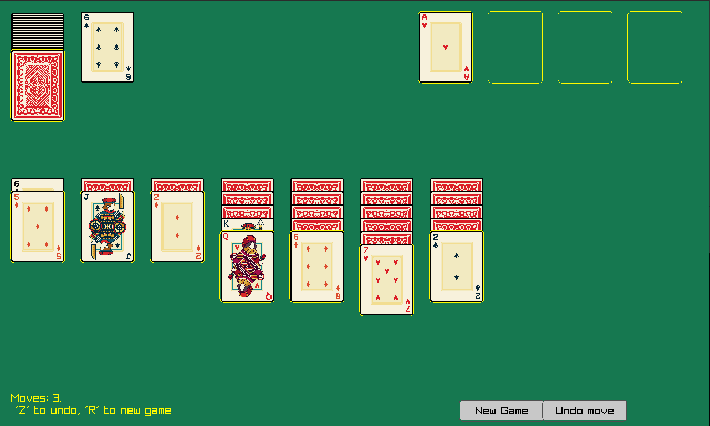
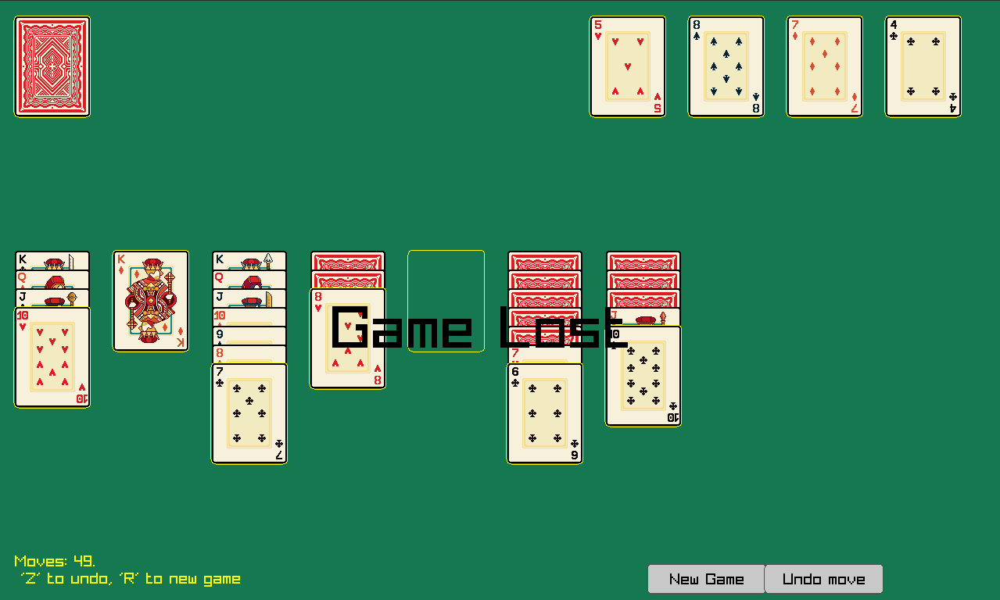

# Solitaire (C++/Raylib) ♠️♥️♣️♦️

A simple Klondike Solitaire implemented in C++20 with Raylib. Features mouse drag & drop, hit-testing, undo, and basic auto-move animation.

- Build system: CMake
- Graphics/Input: Raylib 5.5 (fetched via CMake)
- Assets: card sprite sheets in assets/

## Features

- Drag & drop moving of single cards or chains
- Click stock to advance deck
- Undo last move
- Next move hint
- UI buttons: New Game, Undo move, Show hint
- Auto-move animation when deck is empty and game is won
- Win/lose status text overlay
- Toggle fullscreen mode

Core modules:

- Game logic: [game](include/game.h)
  - State export: `game::export_game_state`
  - Moves/undo: `game::move_card`, `game::undo_move`, `game::next_deck`
- Rendering + hit-test: [renderer](include/renderer.h)
  - Drawing: `renderer::update`
  - Hit-tests: `renderer::hit_test`, `renderer::hit_test_drag`, `renderer::pile_rect_hit`
- Drag handling: [drag_controller](include/drag_controller.h)
- Data structures: [card](include/card.h), [pile](include/pile.h), [move](include/move.h) and [game_state](include/game_state.h)
- Entry point (input + main loop): [main](src/main.cpp)

Architecture:

- [main](src/main.cpp): handles input and translates it to game commands; registers UI buttons
- [game](include/game.h): owns state and rules; provides snapshot for rendering
- [renderer](include/renderer.h): draws and performs view-space hit-tests

## Controls

- Mouse
  - Left click stock: deal next card
  - Left click & drag a face-up card: move (chains supported)
  - Release to drop; valid targets highlight during drag
- Keyboard
  - R: new game
  - Z: undo last move
  - H: show next move hint
  - F: toggle fullscreen mode
- UI Buttons (bottom-right)
  - New Game
  - Undo move
  - Show Hint

## Build

Requires a C++20 compiler, CMake (>=3.15), and system deps for Raylib (on Linux: X11, OpenAL, etc.).

```sh
# Configure
cmake -S . -B build -DCMAKE_BUILD_TYPE=Release
# Build
cmake --build build --parallel
# Run
./build/Solitaire
```

## Download and play

If you don't want to build code yourself check out `Releases` with already built packages or play in your webbrowser at https://naxden.itch.io/solitaire.
Due to lack of official license, packages for Windows and MacOS are marked as untrusted.

## Credits

- Raylib by raysan5 at https://github.com/raysan5/raylib
- Card sprites by Jorel at https://games-by-jorel.itch.io/jorels-card-pack

## Gameplay screenshots



